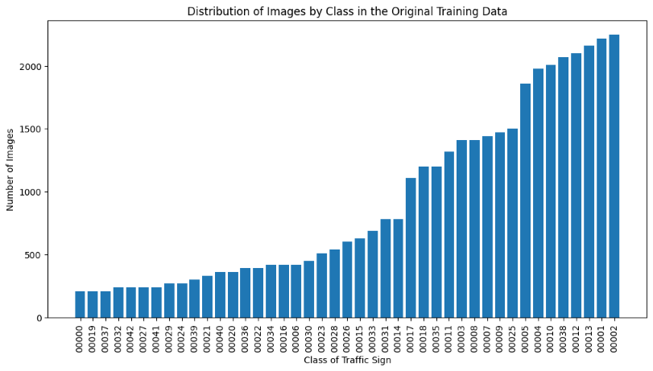
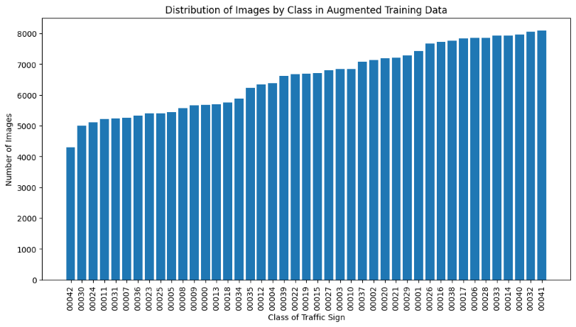
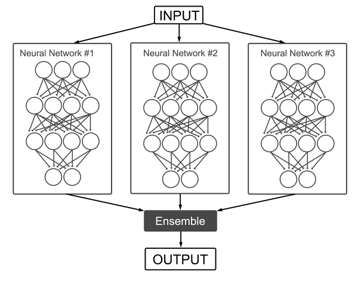

# Road Sign Classification using Convolutional Neural Network

## Key Terms and Concepts

* **Convolutional Neural Network:** 
    * Imagine a digital brain that's been specifically trained to understand and interpret images. This brain can pick out important details from an image, like the shape, color, and symbols on a road sign, and understand how these details relate to each other. This makes CNNs perfect for tasks like identifying road signs from a picture, as they can learn to recognize the patterns that make up each sign.

* **Data Augmentation:**
    * This is a technique we use to make our digital brain even smarter. Imagine if you only ever saw a stop sign from one angle, in perfect lighting conditions. You might struggle to recognize it at night, or when viewed from the side. To avoid this, we take our existing images of road signs and create new ones by rotating, scaling, or cropping them. This helps our system get better at recognizing road signs under a variety of conditions, making it more versatile and reliable.

* **Classification Task:**
    * This is the main job of our digital brain. It's about sorting things into categories. In our case, the task is to correctly categorize different road signs. It's like having a super-fast, super-accurate filing system that can instantly sort new images into one of 43 different categories of road signs.

* **Accuracy and F1 Score:**
    * These are the ways we measure how well our system is doing its job.

    * <u>Accuracy</u>: This is a straightforward way to understand how well our system is performing. It's like a report card for our digital brain. If our system looks at 100 road signs and correctly identifies 95 of them, then its accuracy is 95%. But accuracy alone doesn't tell the whole story. It doesn't distinguish between the different types of errors our system might make. For example, it doesn't tell us if our system is consistently misidentifying one particular type of sign.
    
    * <u>F1 Score</u>: This is where the F1 score comes in. The F1 score is a more nuanced measure of performance. It considers both the *precision* and the *recall* of our system. **Precision** is a measure of how many of the signs our system identified correctly out of all the signs it thought were of a particular type. **Recall**, on the other hand, measures how many signs of a particular type our system identified correctly out of all the actual signs of that type in the dataset. The F1 score combines these two measures into a single number, giving us a more balanced view of our system's performance. It's particularly useful in situations where we care equally about precision and recall, like in our case where both correctly identifying a sign and not missing any sign are equally important.

* **Loss Functions:**
    * In the world of machine learning, a loss function is like a compass for our model. It's a mathematical way of measuring how far off our model's predictions are from the actual results. The goal of our model, like a hiker trying to reach a destination, is to minimize this loss, making the predictions as close as possible to the real results. 

    * Imagine you're playing a game of darts. Each time you throw a dart, you aim for the bullseye. But let's say your dart lands somewhere else on the board. The distance between where your dart landed and the bullseye is similar to the concept of loss in machine learning. Just like you'd adjust your aim based on where your last dart landed, a machine learning model adjusts its predictions based on the loss.

## Methodology

My methodology for this project was a two-pronged approach: *data augmentation* and *model ensembles*.

<u>Data Augmentation</u>:

The first step was to address the imbalance in the dataset. The original dataset was skewed, with some classes of road signs having significantly more images than others (Figure 1). This imbalance could potentially bias the model towards the classes with more images, leading to a less accurate recognition of the underrepresented classes.

**_Figure 1, Original Data Distribution_**

To rectify this, I used a technique called data augmentation. Data augmentation is a process where we create new training samples by applying various transformations to the existing images. These transformations include rotation, shifting (both width and height), shearing, zooming, flipping, and filling. This process not only helped us balance the dataset but also increased the total number of images, which is beneficial for model training.

To automate the data augmentation process, I wrote a Python script using the TensorFlow and Keras libraries. The script traversed through each class in the dataset, applied the transformations to each image, and saved the new images in an augmented directory. This was a crucial step as it allowed us to generate a more diverse set of images for each class, thereby enhancing the robustness of the model. 

The result of this process was a more balanced dataset with a significantly higher number of total images (Figure 2). 

**_Figure 2, Augmented Data Distribution_**

For example, an original image of a 30 km/h speed limit sign (Figure 3) was transformed into a new, rotated image (Figure 4). 

**_Figure 3, Original Image from Class 1_**

**_Figure 4, Augmented Image from Class 1_**

This illustrates how data augmentation can create varied representations of the same sign, enabling the model to recognize signs under different conditions.

<u>Model Ensembles</u>:

One of the primary considerations was whether to develop a new model or utilize a pre-built architecture. After careful deliberation I concluded that leveraging a pre-built architecture would be the most suitable approach. This decision prompted us to confront another question: which pre-built architecture should I adopt? Interestingly, my solution involved employing multiple models simultaneously, also referred to as the ensemble approach.

I assembled an ensemble of models, which can be likened to a team of experts, each bringing their unique strengths to the table. This team consisted of two pre-trained models: DenseNet121 and ResNet50V2. Each of these models was independently trained on the augmented data, developing their own unique understanding and interpretation of the road signs.

To visualize this concept, consider Figure 5 below. It illustrates the general structure of an ensemble of models. Each model in the ensemble (in our case, DenseNet121 and ResNet50V2) operates independently, processing the input data and generating its own predictions. These predictions are then combined, much like a team coming together to make a final decision based on their individual expertise. This ensemble approach leverages the strengths of each model, leading to a more robust and accurate overall prediction.

**_Figure 5, Structure for Model Ensemble_**

When we present an image to this team, each expert makes its own prediction about what sign is in the image. Then, they come together and take a vote. The sign that gets the most votes is the one that the team as a whole predicts.

## Results

My neural network model has demonstrated exceptional performance in classifying German road signs, achieving an accuracy of 100% on the test set and 99.99% on the validation set. This represents a significant improvement over the initial model, with an increase in accuracy of approximately 10%.

When tested on a partial dataset, which is a representative sample of the actual data set we will be tested against, the model maintained a high level of performance, with an accuracy of 99.00% and an F1 score of 99.05%. These results indicate that the model is not only highly accurate but also robust, capable of maintaining its performance even when presented with new, previously unseen data.
